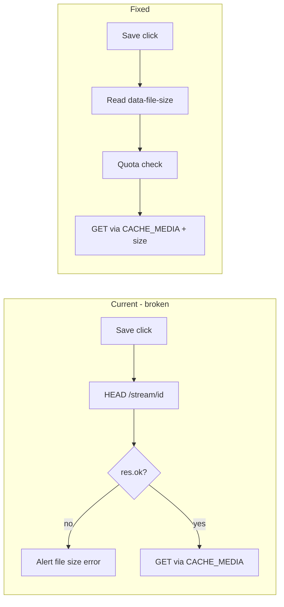

# Dev Readiness Plan (revised)

Target: app fully functional on **localhost** (`http://127.0.0.1:8000`) during development, with offline save and playback working.

---

## Root cause: offline save failure

The alert **"Could not read file size"** comes from exactly one place:

```31:34:app/static/js/pwa.js
  async getFileSize(url) {
    const res = await fetch(url, { method: 'HEAD' });
    if (!res.ok) throw new Error('Could not read file size');
```

### What is actually wrong

| Claim in prior plan | Correction |
|---------------------|------------|
| `/stream/{id}` has no HEAD handler | **Wrong.** FastAPI/Starlette auto-route HEAD to GET handlers. A dedicated `@router.head` is not required. |
| HEAD is inherently broken | **Unlikely on server.** The stream route sets `Content-Length` before returning `StreamingResponse` ([app/routers/stream.py](app/routers/stream.py)). |
| SW is the problem | **Partially right.** [app/static/sw.js](app/static/sw.js) intercepts **all** `/stream/*` requests, including HEAD, via `cacheFirstStream`. On network failure it returns **503**, which surfaces as the same user-facing error. |

### Real bugs and inefficiencies

1. **Unnecessary HEAD preflight** — `saveMedia()` does HEAD for quota, then `cacheMedia()` does a full GET. Two round-trips for one job.
2. **SW can poison the media cache** — if a HEAD ever returns 200, line 125 caches it (`status === 200`, no method check). An empty-body HEAD response would break playback for that item.
3. **Size is already known server-side** — `file_size` is set after transcoding ([app/services/media.py](app/services/media.py) line 155). Public list and player only show `ready` items, so the DB value is the final transcoded size.
4. **SW meta size depends on GET headers** — [cacheMedia](app/static/sw.js) reads `Content-Length` from the fetch response; passing size from the client is simpler and consistent.



---

## Priority 1 — Fix offline save (3 small changes)

### 1a. Use server-known size; remove HEAD

- [app/templates/player.html](app/templates/player.html) — `data-file-size="{{ item.file_size }}"` on `.save-offline-btn`
- [app/templates/index.html](app/templates/index.html) — same on list save buttons
- [app/static/js/pwa.js](app/static/js/pwa.js):
  - `saveMedia()`: `const fileSize = parseInt(btn?.dataset.fileSize || '0', 10)`; error clearly if `0`
  - **Delete `getFileSize()`** — no fallback HEAD; it reintroduces the bug

### 1b. Harden service worker stream handler

In [app/static/sw.js](app/static/sw.js) `cacheFirstStream`, at the top:

```javascript
if (request.method !== 'GET') {
  return fetch(request);
}
```

Keeps existing rule: only cache `GET` + `status === 200` + no `Range` header.

### 1c. Pass size into CACHE_MEDIA

- [app/static/js/pwa.js](app/static/js/pwa.js): `postToSW({ type: 'CACHE_MEDIA', url, mediaId, title, size: fileSize })`
- [app/static/sw.js](app/static/sw.js) `cacheMedia`: use `event.data.size` for meta; fall back to `Content-Length` from response

### 1d. Bump shell cache version

When editing `pwa.js` or `sw.js`, increment `CACHE_SHELL` in [app/static/sw.js](app/static/sw.js) (currently `qas-shell-v5` → `v6`). Without this, localhost dev can keep serving stale JS after reload.

**Do not add** a separate HEAD route or HEAD pytest — redundant once the client stops using HEAD.

---

## Priority 2 — Service worker readiness

Separate issue (different alert: "Service worker not ready"). [pwa.js](app/static/js/pwa.js) registers on `DOMContentLoaded` but never waits for a controller.

- After `registerSW()`, `await navigator.serviceWorker.ready`
- Disable `.save-offline-btn` until `navigator.serviceWorker.controller` exists; enable on `controllerchange`
- Avoid extra `alert()` for the ready case — disabled button + short hint is enough

`clients.claim()` is already in SW activate; no server change needed.

---

## Priority 3 — Localhost offline QA

Service workers work on `localhost` without HTTPS. Checklist (from [docs/PWA_QA.md](docs/PWA_QA.md), trimmed):

1. Hard refresh after SW/JS changes (or close all tabs for the origin)
2. Confirm `navigator.serviceWorker.controller` in DevTools → Application
3. Save from player and home list → "Saving…" → "Saved offline"
4. `/offline` lists item with correct size
5. DevTools → Network → Offline → play media, seek, remove
6. Offline banner appears when network is off

**Dev troubleshooting:** if save still fails after code changes, check Application → Service Workers → unregister, then hard refresh.

---

## Priority 4 — Core flow smoke test

Quick pass after transcoding changes (roadmap marks these done; verify on your machine):

| Area | Check |
|------|-------|
| Bootstrap | `.env`, ffmpeg/ffprobe on PATH, `uvicorn app.main:app --reload`, superuser login |
| Upload | iPhone `.mov` / `.m4a` → progress bar → status poll → `ready` on `/` |
| Playback | Video + audio in Video.js; resume position ([app/static/js/player.js](app/static/js/player.js)) |
| Auth/admin | Invite link in admin flash → register → upload as user → superuser delete |
| Failed upload | Bad file → `failed` badge on upload page only; not on public list |
| Tests | `pytest` (ffmpeg required, same as CI) |

---

## Priority 5 — Defer (not blocking localhost dev)

- **Thumbnail offline** — `/thumbnail/{id}` not cached with media; video poster missing offline until play starts
- **Stale offline entries** — server-side media delete does not clear SW cache; `/offline` may show deleted items until manually removed
- **HTMX from CDN** — [app/templates/base.html](app/templates/base.html) loads unpkg; upload status poll fails offline (upload page only)
- **Production PWA QA** — iPad/Chromebook over HTTPS ([docs/PWA_QA.md](docs/PWA_QA.md))
- **B2 backend** — local storage is fine for dev

---

## Implementation order

1. `data-file-size` + remove `getFileSize` + pass size to SW (**unblocks save**)
2. SW non-GET guard + `CACHE_SHELL` bump
3. SW ready / button disable UX
4. Manual offline QA
5. Core smoke test + `pytest`
6. Defer polish

## Files to touch

| File | Change |
|------|--------|
| [app/templates/player.html](app/templates/player.html) | `data-file-size` |
| [app/templates/index.html](app/templates/index.html) | `data-file-size` |
| [app/static/js/pwa.js](app/static/js/pwa.js) | Use dataset size; remove HEAD; pass size to SW; SW ready |
| [app/static/sw.js](app/static/sw.js) | Non-GET guard; accept size in CACHE_MEDIA; bump shell version |

No changes needed to [app/routers/stream.py](app/routers/stream.py) for this fix.
